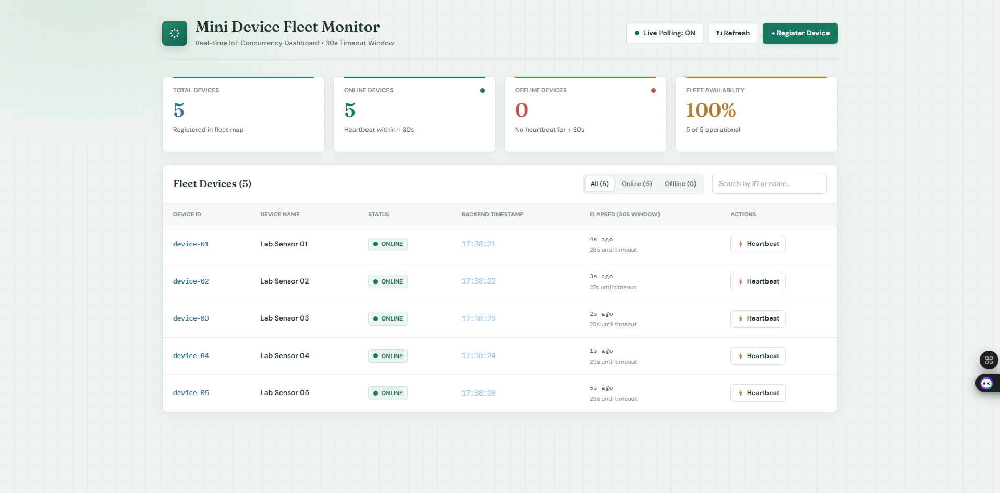

# 🚀 Mini Device Fleet Monitor

```powershell
# 1. Start backend server
go run ./cmd/server

# 2. In a second terminal, start the multi-device simulator
go run ./cmd/simulator

# 3. (Optional) Run frontend in Vite development mode
cd frontend
npm.cmd run dev
```

An IoT device fleet monitoring application built with **Go** (standard library concurrency & HTTP), **React** (real-time telemetry dashboard), and **Docker**.



---

## 🛠️ Tech Stack

### 🔹 Backend (API & Engine)
* **Language**: [Go (Golang)](https://go.dev/) (v1.22+)
* **HTTP Framework**: Native Go `net/http` standard library (zero external framework bloat)
* **Concurrency & Synchronization**: Goroutines, Channels, and `sync.RWMutex` for high-throughput, thread-safe in-memory state management
* **Automated Testing**: Go `testing` standard library with unit, concurrency, and REST integration tests (`go test -v ./...`)

### 🔹 Frontend (Web Dashboard)
* **Library / UI**: [React 18](https://react.dev/) (Hooks, `useCallback`, `useEffect`, dynamic time countdowns)
* **Build Tool**: [Vite](https://vitejs.dev/) (Ultra-fast HMR and optimized production asset bundling)
* **Styling & Design**: Modern Vanilla CSS3
  * CSS Custom Properties (Theme tokens)
  * CSS Grid & Flexbox responsive layout
  * Glassmorphism, subtle glowing indicators, and pulsing live status dots
* **Typography**: DM Sans, Fraunces (Display), and IBM Plex Mono (Telemetry / Timestamps)
* **Real-time Architecture**: 2-second background polling loop synced with a 1-second dynamic client countdown ticker

### 🔹 Device Simulation CLI
* **Language**: Go (Golang)
* **Concurrency Model**: Multi-goroutine worker architecture simulating independent IoT nodes emitting `POST` heartbeat payloads every 5 seconds
* **Interactive Shell**: Real-time CLI terminal control (`start <id>`, `stop <id>`, `status`, `exit`)

### 🔹 DevOps & Deployment
* **Containerization**: [Docker](https://www.docker.com/) (Multi-stage build with Node.js + Go Alpine for an ultra-lightweight production image)
* **Orchestration**: [Docker Compose](https://docs.docker.com/compose/) (Single-command orchestration configured on port `9090`)

---

## 📖 Overview

The **Mini Device Fleet Monitor** tracks connected IoT hardware sensors in real time. Devices continuously report their health by sending heartbeat signals with telemetry metrics.

### ⏱️ The 30-Second Rule
* **🟢 ONLINE**: A device is considered **ONLINE** if it has sent at least one heartbeat within the last **30 seconds** ($\le 30\text{s}$).
* **🔴 OFFLINE**: If **more than 30 seconds** pass without a heartbeat, the device automatically transitions to **OFFLINE**.
* **⚡ REVIVAL**: Sending a fresh heartbeat (via simulator or the UI **⚡ Heartbeat** button) instantly revives an offline device back to **ONLINE**.

---

## ⚡ Quick Start (How to Run)

You can run this project either **Natively using Go** or **Inside a Docker Container**.

### Option 1: Native Execution with Go (Fastest)

#### Step 1: Start the Backend Server
Open a terminal in the project root folder and run:
```powershell
# Run on default port 8080:
go run ./cmd/server

# OR run on custom port (e.g. 9090):
$env:PORT="9090"; go run ./cmd/server
```
> The Go server automatically serves both the **REST API** and the pre-compiled **React Dashboard UI**!

#### Step 2: Open the Web Dashboard
Open your web browser and navigate to:
👉 **[http://localhost:9090/](http://localhost:9090/)** *(or `http://localhost:8080/` if using default port)*

#### Step 3: Start the Multi-Device Simulator
In a **second terminal window**, run the simulator:
```powershell
# If your server is on port 9090:
go run ./cmd/simulator -server=http://localhost:9090

# If your server is on port 8080:
go run ./cmd/simulator
```
* The simulator automatically registers **5 devices** (`device-01` to `device-05`) and sends heartbeats every 5 seconds.
* Watch the web dashboard — all 5 devices will turn **ONLINE** with glowing green status badges!

---

### Option 2: Running the React Frontend in Development Mode (Vite)

> **Note:** When you start the Go server (`go run ./cmd/server`), it **already serves the pre-built React frontend** automatically.
> However, if you want to modify UI code or run with Vite Hot Module Reloading (HMR):

1. Open a terminal in the `frontend/` folder:
   ```bash
   cd frontend
   ```
2. Install dependencies (if first time):
   ```bash
   npm install
   # Windows PowerShell: npm.cmd install
   ```
3. Start Vite dev server:
   ```bash
   npm run dev
   # Windows PowerShell: npm.cmd run dev
   ```
4. Open your browser at:
   👉 **[http://localhost:5173/](http://localhost:5173/)**
   *(Vite automatically proxies backend API calls to port `8080` / `9090`).*

5. To rebuild the production bundle served by Go / Docker:
   ```bash
   npm run build
   # Windows PowerShell: npm.cmd run build
   ```

---

### Option 3: Run with Docker & Docker Compose

If you have Docker Desktop installed and running:

#### Using Docker Compose (Runs on Port 9090):
```bash
docker compose up
```

#### Using Docker CLI:
```bash
# 1. Build the container image:
docker build -t fleet-monitor .

# 2. Run container mapped to port 9090:
docker run --rm -p 9090:8840 fleet-monitor

# (Or run on any other port like 8840, 8080, 5000):
docker run --rm -p 8840:8840 fleet-monitor
```
Open **[http://localhost:9090/](http://localhost:9090/)** in your browser.

---

## 🧪 Testing the 30-Second Timeout Rule

To see the 30-second rule in action:

1. Open the dashboard at **[http://localhost:9090/](http://localhost:9090/)**.
2. In the simulator terminal, stop heartbeats for one device:
   ```text
   stop device-03
   ```
3. Watch the row for `device-03` on the browser:
   * The countdown timer counts down from 30 seconds.
   * At $t = 31\text{s}$, `device-03` immediately flips to **OFFLINE** (red badge).
   * The fleet metrics at the top update dynamically (`Offline: 1`, `Online: 4`).
4. To bring `device-03` back online:
   * Click the **⚡ Heartbeat** button in the browser row, or
   * Type `start device-03` in the simulator terminal.
   * `device-03` immediately returns to **ONLINE**!

---

## 📡 REST API Endpoints

| Method | Endpoint | Description |
|---|---|---|
| `POST` | `/devices` | Register a new device (`{"id": "dev-01", "name": "Sensor 01"}`) |
| `POST` | `/devices/{id}/heartbeat` | Send heartbeat payload (`{"timestamp": "...", "status": "OK"}`) |
| `GET` | `/devices` | List all registered devices with computed status |
| `GET` | `/devices/{id}` | Retrieve individual device status and telemetry |
| `GET` | `/summary` | Fleet totals: `{"total": 5, "online": 4, "offline": 1}` |

### Example cURL Commands

```bash
# 1. Register a device:
curl -X POST http://localhost:9090/devices \
  -H "Content-Type: application/json" \
  -d '{"id": "device-06", "name": "Backup Sensor"}'

# 2. Send a Heartbeat:
curl -X POST http://localhost:9090/devices/device-06/heartbeat \
  -H "Content-Type: application/json" \
  -d '{"status": "OK"}'

# 3. View Fleet Summary:
curl http://localhost:9090/summary
```

---

## 🧪 Running Automated Tests

Run the full Go test suite (status boundaries, concurrency safety, validation, and HTTP integration):

```bash
go test -v ./...
```

---

## 📁 Project Architecture

```
EXAM/
├── cmd/
│   ├── server/             # Go HTTP Server & static asset serving
│   └── simulator/          # Multi-device CLI simulator
├── internal/
│   ├── api/                # API router and middleware
│   └── device/             # Thread-safe in-memory store & status logic
├── frontend/
│   ├── src/                # React dashboard components & real-time clock
│   └── dist/               # Production-ready compiled web assets
├── Dockerfile              # Multi-stage production container build
├── docker-compose.yml      # Docker compose configuration (Port 9090)
├── picture.png             # UI Dashboard screenshot
├── RUN.md                  # Comprehensive run guide
└── README.md               # Main project documentation
```
