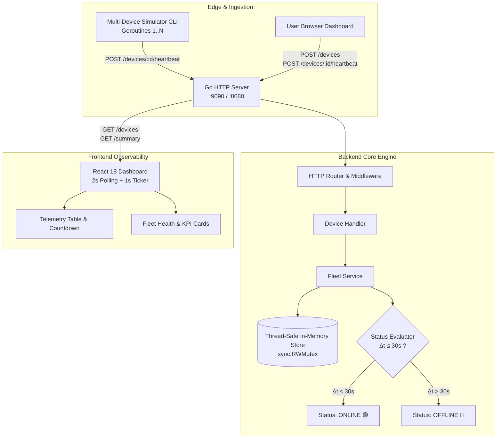

# 🚀 Mini Device Fleet Monitor

An enterprise-grade, lightweight IoT device fleet monitoring and telemetry platform built with **Go** (high-concurrency standard library & HTTP), **React** (real-time telemetry dashboard with independent countdown tickers), and **Docker**.


---

## 📌 About The Project

In real-world IoT deployments—such as smart factories, edge sensor grids, connected vehicles, and telecom base stations—hundreds or thousands of edge hardware nodes continuously communicate with central servers. Maintaining visibility into which devices are actively functioning, which have degraded or disconnected, and which have recovered is critical for operational stability.

The **Mini Device Fleet Monitor** is an end-to-end, high-throughput fleet management system engineered to solve this problem. It ingests continuous health telemetry and heartbeat signals from simulated or physical hardware devices, calculates operational statuses on-the-fly using a deterministic **30-second sliding timeout rule**, and delivers instant visual observability through an interactive, glassmorphic React dashboard.

### 🎯 Key Objectives & Problem Solved

* **Zero-Lag Status Detection**: Instantly marks devices as `OFFLINE` if no heartbeat has been received within 30 seconds, and immediately revives them to `ONLINE` upon the arrival of fresh telemetry.
* **Lock-Safe High Concurrency**: Eliminates race conditions across hundreds of concurrent device goroutines using Go's `sync.RWMutex`, allowing non-blocking read spikes while ensuring atomic writes.
* **Minimalist & Zero-Bloat Footprint**: Built with pure Go standard libraries (`net/http`) without heavy third-party framework overhead, serving both the REST API and compiled web assets from a single binary or container.
* **True Client-Side Determinism**: Every device card in the frontend dashboard computes its own elapsed duration and countdown timer independently based on UTC timestamps.

---

## ✨ Core Features

### 1. ⏱️ Dynamic 30-Second Timeout Rule Engine

* **🟢 ONLINE ($\le 30\text{s}$)**: When a device transmits a heartbeat, it is marked **ONLINE** and an active 30-second countdown window begins.
* **🔴 OFFLINE ($> 30\text{s}$)**: If the elapsed time since the device's last recorded heartbeat exceeds 30 seconds, its status transitions to **OFFLINE**.
* **⚡ Instant Revival**: Transmitting a fresh heartbeat instantly revives an offline device back to **ONLINE** with zero restart required.
* **Dynamic Evaluation**: Device statuses are evaluated dynamically at query time based on `time.Now().Sub(lastHeartbeat)`, ensuring data is always fresh and never stale.

### 2. 🖥️ Modern React 18 Telemetry Dashboard

* **Real-time Live Polling**: Synchronizes with the backend every 2 seconds (`2000ms`) to fetch latest fleet metrics and device statuses.
* **Individual Live Countdown Tickers**: Client-side 1-second interval timers compute the exact seconds elapsed and time remaining before timeout for each device independently.
* **Fleet Availability KPIs**: Displays live counts of Total Devices, Online Nodes, Offline Nodes, and an automated Fleet Availability Health Percentage ($(\text{Online} / \text{Total}) \times 100$).
* **Instant Action Triggers**:

  * ⚡ **1-Click Heartbeat**: Send manual telemetry pings directly to any device to test revival and countdown resets.
  * ➕ **Device Registration Modal**: Add new device identifiers and descriptive labels.
  * ⚡ **1-Click Sample Generator**: Instant node creation for quick stress-testing.
* **Search & Multi-State Filtering**: Filter by `ALL`, `ONLINE`, or `OFFLINE` statuses alongside instant text search across device IDs and names.
* **Interactive Operations Side Panel**: Built-in tabbed guide explaining Quick Setup, Live Polling, Heartbeat Mechanics, and Backend Architecture.

### 3. 🤖 Concurrent Multi-Device Simulator CLI

* **Multi-Goroutine Node Emulation**: Automatically registers 5 default IoT sensor nodes (`device-01` to `device-05`) and launches parallel worker goroutines emitting heartbeats every 5 seconds.
* **Interactive CLI Control Shell**:

  * `stop <device-id>`: Temporarily halts heartbeats for a device to test the 30s timeout and observe it transition to `OFFLINE`.
  * `start <device-id>`: Resumes heartbeats to watch the device revive back to `ONLINE`.
  * `status`: Prints a summary table of running goroutines and active simulators.
  * `exit`: Gracefully shuts down all workers.

### 4. 🔒 Thread-Safe High-Throughput Go Architecture

* In-memory storage backed by `sync.RWMutex`:

  * `RLock()`: Enables high-volume concurrent reads for polling endpoints (`/summary`, `/devices`) without thread contention.
  * `Lock()`: Guarantees atomic writes during device registration and heartbeat updates.
* Clean internal package design separating handlers, services, repositories, and models.

---

## 🏗️ System Architecture & Data Flow



---

## 🛠️ Tech Stack

| Layer                | Technology              | Description                                                                  |
| -------------------- | ----------------------- | ---------------------------------------------------------------------------- |
| **Backend Engine**   | **Go (Golang 1.22+)**   | Native `net/http` standard library, Goroutines, Channels, `sync.RWMutex`     |
| **Testing**          | **Go `testing`**        | Unit tests, concurrency safety tests, race detection, HTTP integration tests |
| **Frontend UI**      | **React 18 + Vite**     | Functional components, custom hooks, dynamic interval timers                 |
| **Styling**          | **Modern Vanilla CSS3** | Custom properties (tokens), Glassmorphism, CSS Grid, pulsing status beacons  |
| **Typography**       | **Google Fonts**        | DM Sans (UI), Fraunces (Headings), IBM Plex Mono (Telemetry & Timestamps)    |
| **Device Simulator** | **Go CLI**              | Interactive REPL, concurrent background worker goroutines, HTTP client       |
| **DevOps**           | **Docker & Compose**    | Multi-stage Dockerfile (Node + Go Alpine), Docker Compose orchestration      |
| **Registry**         | **Docker Hub**          | Pre-built image: `siddhant8840/simnovus-project:latest`                      |

---

## ⚡ Quick Start

The project runs using **Docker Compose**.

### 1. Clone the Repository

```bash
git clone https://github.com/siddhant8840/Simnovus-project.git
```

### 2. Enter the Project Directory

```bash
cd Simnovus-project
```

### 3. Build and Run

```bash
docker compose up --build
```

### 4. Open the Dashboard

After the Docker container starts, open:

**http://localhost:9090/**

---

## 🧪 Testing the 30-Second Timeout Rule

1. Open the dashboard at **http://localhost:9090/**.
2. Use the device controls available in the dashboard to test heartbeat behavior.
3. The countdown timer tracks the 30-second heartbeat window.
4. When the heartbeat timeout is exceeded, the device transitions to **OFFLINE**.
5. Sending a fresh heartbeat immediately revives the device to **ONLINE**.

---

## 📡 REST API Reference

### 1. Register a Device

```http
POST /devices
Content-Type: application/json

{
  "id": "device-06",
  "name": "Edge Gateway East"
}
```

**Response (`201 Created`):**

```json
{
  "id": "device-06",
  "name": "Edge Gateway East",
  "status": "OFFLINE",
  "last_heartbeat": null
}
```

### 2. Send Device Heartbeat

```http
POST /devices/{id}/heartbeat
Content-Type: application/json

{
  "timestamp": "2026-09-30T18:30:00Z",
  "status": "OK",
  "cpu_usage": 34.2,
  "signal_strength": -65
}
```

**Response (`200 OK`):**

```json
{
  "id": "device-06",
  "name": "Edge Gateway East",
  "status": "ONLINE",
  "last_heartbeat": "2026-09-30T18:30:00Z"
}
```

### 3. List All Devices

```http
GET /devices
```

**Response (`200 OK`):**

```json
[
  {
    "id": "device-01",
    "name": "Sensor Node 01",
    "status": "ONLINE",
    "last_heartbeat": "2026-09-30T18:29:55Z"
  },
  {
    "id": "device-06",
    "name": "Edge Gateway East",
    "status": "OFFLINE",
    "last_heartbeat": null
  }
]
```

### 4. Get Fleet Summary

```http
GET /summary
```

**Response (`200 OK`):**

```json
{
  "total": 6,
  "online": 5,
  "offline": 1
}
```

---

## 🧪 Running Automated Tests

The test suite covers status boundaries ($t=0\text{s}, t=29\text{s}, t=30\text{s}, t=31\text{s}$), race condition safety with 100 concurrent goroutines, and end-to-end HTTP integration.

```bash
go test -v ./...
```

```bash
go test -v -race ./...
```

---

## 📁 Repository Structure

```text
EXAM/
├── cmd/
│   ├── server/             # Main HTTP server entrypoint & static asset server
│   └── simulator/          # Interactive multi-device CLI simulator tool
├── internal/
│   ├── api/                # API helpers, JSON responses, error formats
│   └── device/              # Thread-safe in-memory store, models, status evaluator & tests
├── frontend/
│   ├── src/                # React 18 dashboard, countdown timers, guide side panel
│   ├── dist/               # Compiled production assets embedded by Go server
│   ├── package.json        # Frontend dependencies & build scripts
│   └── vite.config.js      # Vite build & proxy configuration
├── Dockerfile              # Multi-stage production container build (Node + Go Alpine)
├── docker-compose.yml      # Single-command container deployment (Port 9090)
├── picture.png             # UI Dashboard screenshot
├── sidd.txt                # Fast execution reference commands
├── RUN.md                  # Detailed step-by-step running manual
└── README.md               # Main project documentation & technical specification
```

---

## 📄 License & Attribution

Designed and engineered for high-performance IoT device fleet telemetry and observability. Distributed under the MIT License.
